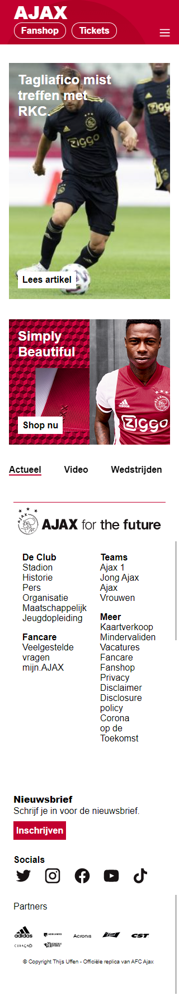
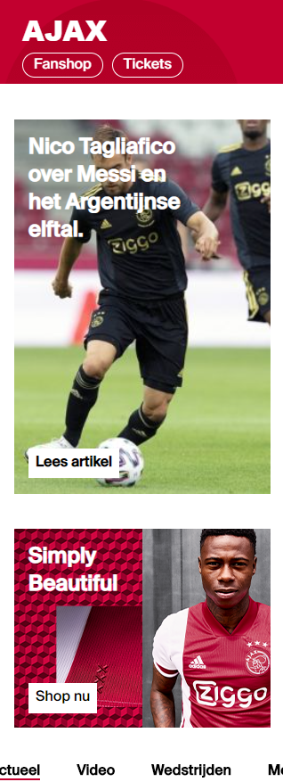
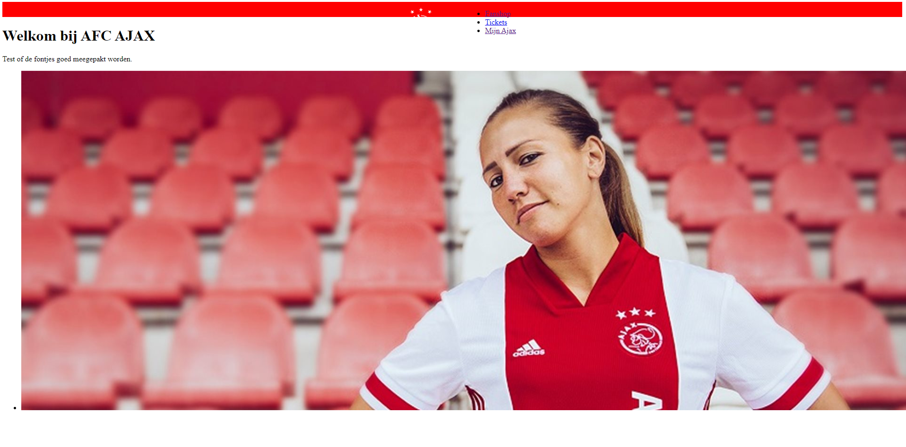
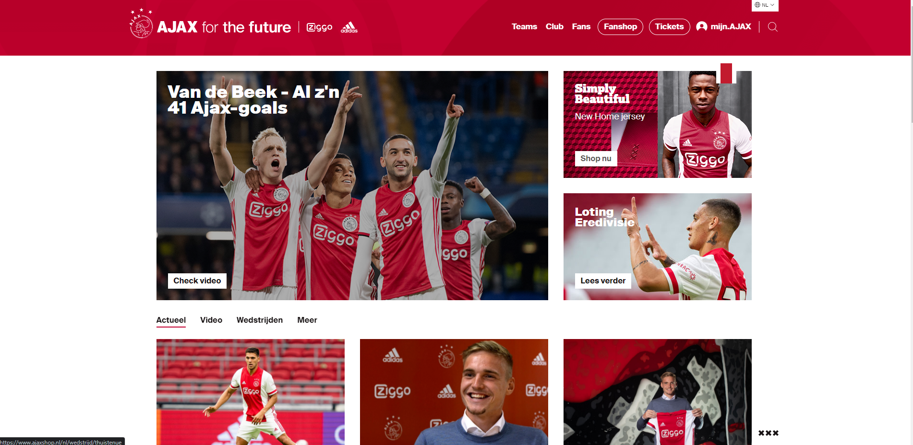
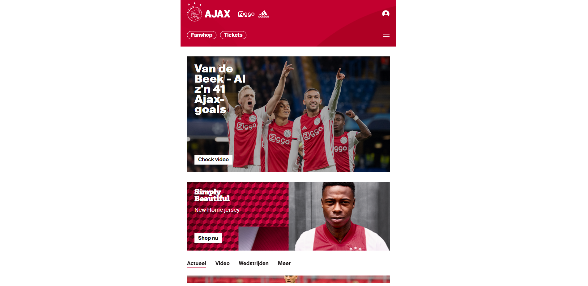
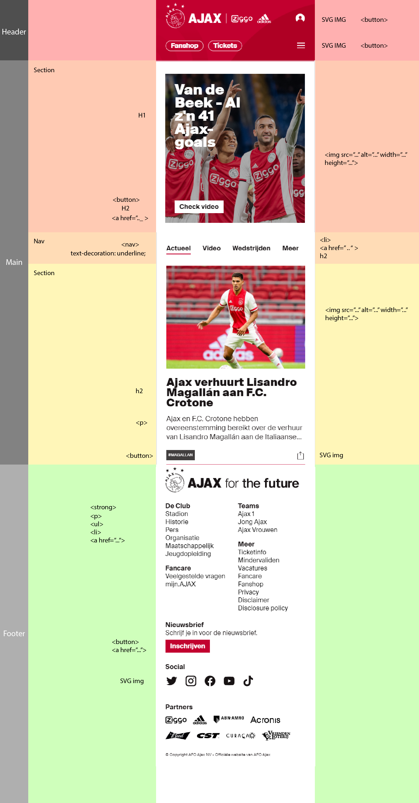

# Procesverslag
**Auteur:** Thijs Uffen, 500787477

https://theseus020.github.io/Blokweb/

Markdown cheat cheet: [Hulp bij het schrijven van Markdown](https://github.com/adam-p/markdown-here/wiki/Markdown-Cheatsheet). Nb. de standaardstructuur en de spartaanse opmaak zijn helemaal prima. Het gaat om de inhoud van je procesverslag. Besteedt de tijd voor pracht en praal aan je website.

## Bronnenlijst
1. -bron 1-
2. -bron 2-
3. -...-

## Eindgesprek (week 7/8)

Bij het eindgesprek heb ik mijn volledige site afgekregen. Ik heb een JS interactie gemaakt door een uitklapbaar menu toe te voegen. Ik heb foutjes uit de code verwerkt, zoals de bestandnamen van images zonder '/' te laten beginnen. Ook heb ik mijn styling aangepast. Ik heb een footer gemaakt met daarin twee UL's die naast elkaar staan. Ik had nog een vage bug in mijn homepage zitten, de nav nam namelijk veel ruimte in beslag. Deze hebben Robert en ik helaas niet meer weten op te lossen.

**Screenshot(s):**

## Voortgang 3 (week 6)

In deze week hadden we geleerd over toegankelijkheid. Het is belangrijk dat je HTML clean is en dat je niet overal onnodig classes toevoegd. Ook moeten ALT's en benamingen van je content goed gemeld worden, want anders levert dat problemen op voor mensen met een beperking.
Toen ik mijn website besprak met de studentassistent vertelde hij me dat ik mijn classes moest aanpassen. Ook kon ik de body van de verschillende pagina's een aparte class geven, zodat ik dit gemakkelijk kan stylen. 

## Voortgang 2 (week 5)

In deze week kregen we wat te horen over CSS grids en mediaquery. Ik ga dit uiteindelijk niet gebruiken omdat ik mijn website niet responsive ga maken. Het is toch nuttig om deze trucjes te leren, mocht ik het ooit nodig hebben. Deze week kreeg ik feedback van Robert. Hij vertelde me dat ik mijn classnames en opmaak van HTML moest aanpassen, omdat deze semantisch niet correct was. 

## Voortgang 1 (week 3)

### Stand van zaken

In week 3 hadden we het eerste voortganggesprek met een student assistent. Hij gaf ons enkele handige tips, die we wel zelf moesten achterhalen. Dus er werd niet echt kritisch gekeken naar onze code. Wat ik op dat moment had was vrij minimaal, omdat ik sommige elementen niet helemaal doorhad. 

## Intake (week 1)

**Je startniveau:** Ik denk dat ik op <strong>blauw</strong> zit, omdat het een tijd geleden is dat ik met HTML/CSS/Java gewerkt heb. Ik heb zeker wel genoeg kennis om van start te gaan, en misschien haal ik dingen sneller op dan verwacht. Maar op dit moment moet ik mijn skills even oppoetsen.

**Je focus:** Ik wil mezelf uitdagen, ik wil sowieso mijn programmeerskills naar een hoger niveau tillen. Ik begin met het focussen op de surface van mijn website, en wellicht dat ik er later voor kies om de site responsive te maken.

**Je opdracht:** https://www.ajax.nl <---- Ik denk dat ik goed aan de slag kan met de website van Ajax. Ze gebruiken een duidelijk grid en hebben toch eigenzinnige stijlelementen. De site zelf heeft niet echt veel microinteracties/animaties. Als me het lukt zou ik het tof vinden om deze zelf toe te voegen.

**Screenshot(s):**

**Breakdown-schets(en):**

