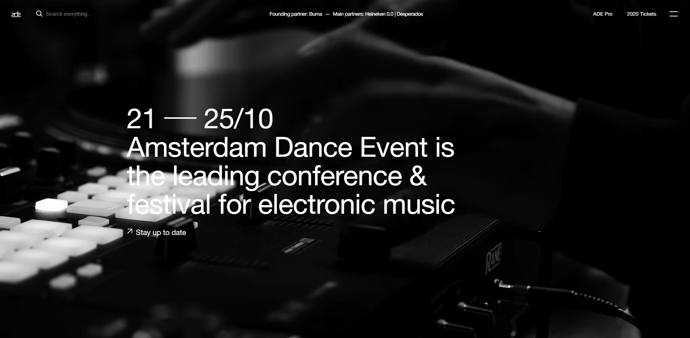
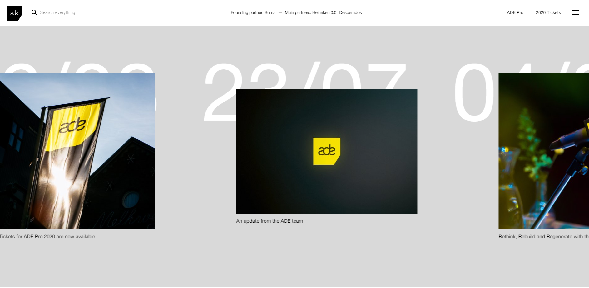

# Procesverslag
**Auteur:** Thijs Uffen, 500787477

Markdown cheat cheet: [Hulp bij het schrijven van Markdown](https://github.com/adam-p/markdown-here/wiki/Markdown-Cheatsheet). Nb. de standaardstructuur en de spartaanse opmaak zijn helemaal prima. Het gaat om de inhoud van je procesverslag. Besteedt de tijd voor pracht en praal aan je website.

## Bronnenlijst
1. -bron 1-
2. -bron 2-
3. -...-

## Eindgesprek (week 7/8)

-dit ging goed & dit was lastig-

**Screenshot(s):**

-screenshot(s) van je eindresultaat-

## Voortgang 3 (week 6)

-same as voortgang 1-

## Voortgang 2 (week 5)

-same as voortgang 1-

## Voortgang 1 (week 3)

### Stand van zaken

-dit ging goed & dit was lastig-

**Screenshot(s):**

-screenshot(s) van hoe ver je bent-

### Agenda voor meeting

-samen met je groepje opstellen-

### Verslag van meeting

-na afloop snel uitkomsten vastleggen-

## Intake (week 1)

**Je startniveau:** Ik denk dat ik op rood zit. Mijn kennis van HTML en CSS is goed, van Javascript moet ik nog meer leren.

**Je focus:** Ik wil mezelf uitdagen, ik ga dus proberen om op de surface focussen én een responsive site te maken. Gaandeweg ga ik ontdekken of dit lukt, maar ik heb er vertrouwen in.

**Je opdracht:** -https://www.amsterdam-dance-event.nl/en/ <---- deze website vind ik heel vet en immersive. Het opzij scrollen vind ik ook een cool element. Ik ga hiermee beginnen om te kijken of het me lukt, maar misschien dat ik later nog van website wissel.-

**Screenshot(s):**

**Breakdown-schets(en):**

